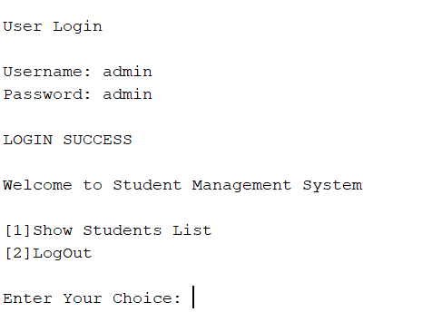
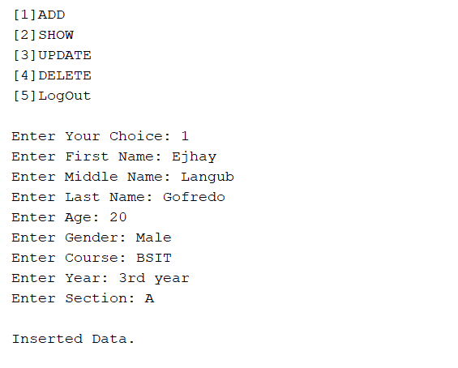
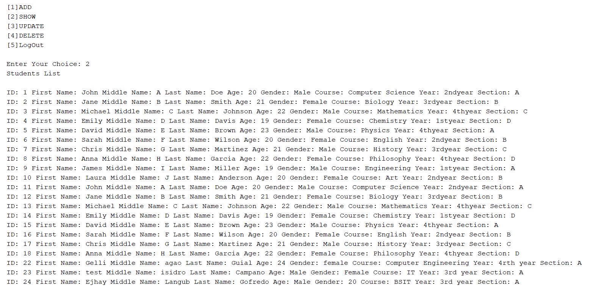
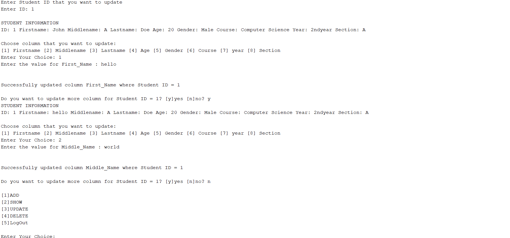
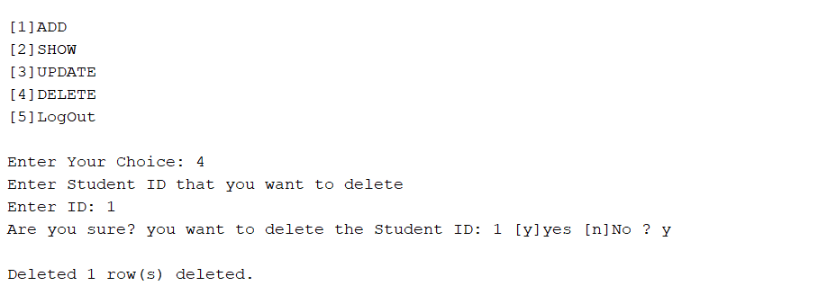

# Student Information Management System

## Overview 📌
This Java project is a simple student information management system that allows users to manage student records stored in a database. The system includes functionalities to add, delete, display, and update student records, as well as user login and logout functionalities.

## Login



## Add Students



## Show List Students



## Update Student



## Delete Student



## Features 📌
- User authentication (Login/Logout)
- Add new student records
- Update existing student details
- Display a list of all students
- Delete student records
    
## Tech Stack 📌
- **Programming Language:** Java
- **Database:** Apache Derby
- **Interface:** Console-based application


# Project Structure 📌
## Packages and Classes
### Declaration Package
- Variables: Holds common variables for database connections and student information.

### HttpMethod Package 
- Add: Handles adding a new student record to the database.
- Delete: Handles deleting a student record from the database.
- Display: Handles displaying all student records from the database.
- Update: Handles updating an existing student record in the database.

### UserEntry Package
- Login: Manages user login by verifying credentials against the database.
- Logout: Manages user logout.

### informationsystem Package
- InformationSystem: The main class that initiates the application by connecting to the database and prompting the user to log in.

# Database Setup 📌

### Create the database:
- Create a database named StudentInformation.
### Create required tables:
- Run the following SQL statements to create the account and students tables:

``` bash
CREATE TABLE account (
    username VARCHAR(50),
    password VARCHAR(50)
);

INSERT INTO account (username, password) VALUES ('admin', 'admin');

CREATE TABLE Students (
    Student_ID INT PRIMARY KEY GENERATED ALWAYS AS IDENTITY,
    First_Name VARCHAR(50),
    Middle_Name VARCHAR(50),
    Last_Name VARCHAR(50),
    Age VARCHAR(50),
    Gender VARCHAR(10),
    Course VARCHAR(50),
    Student_Year VARCHAR(50),
    Section VARCHAR(50)
);
```


# Usage 📌
- Compile the project: Compile all Java files using your preferred IDE or command-line tools.
- Run the application: Execute the InformationSystem class to start the application.
- Login: Enter the username and password to log in.
- Perform operations: Based on user choice, add, delete, display, or update student records.
- Logout: Use the logout functionality to exit the application.

## Note
- Ensure the database StudentInformation is set up and accessible at jdbc:derby://localhost:1527/StudentInformation.
- Handle any required dependencies or configurations specific to your environment.

This project provides a basic framework for managing student information and can be extended or modified to meet specific requirements.